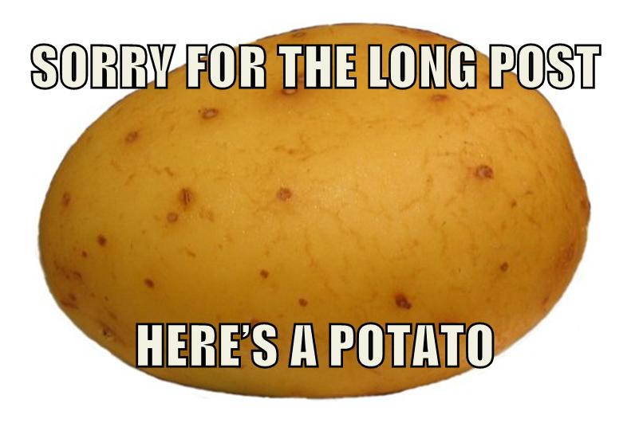

# Reference

## Table of Contents

-   [Bussiness](#bussiness)
-   [Management 101](#management-101)
    -   [Engineering Management](#engineering-management)
    -   [Human Resource](#human-resource)
-   [Product Development](#product-development)
    -   [User Experience](#user-experience)
-   [Software Development](#software-development)
    -   [Design Pattern](#design-pattern)
-   [Potato](#potato)

-   [Another Reference](#another-reference)

## Bussiness

There is nothing yet

## Management 101

### Engineering Management

| Title                                                            | Description                 |
| :--------------------------------------------------------------- | :-------------------------- |
| [The Eng Team Handbook](https://github.com/raylene/eng-handbook) | เห็นพี่ต้าแชร์ แล้วคิดว่าดี |

[Back to Top](#table-of-contents)

### Human Resource

| Title                                                                                                                                                                | Description             |
| :------------------------------------------------------------------------------------------------------------------------------------------------------------------- | :---------------------- |
| [8 Bad Mistakes That Make Good Employees Leave](https://www.forbes.com/sites/travisbradberry/2016/09/07/8-bad-mistakes-that-make-good-employees-leave/#24fdfb1943b7) | จาก Mission to the moon |

[Back to Top](#table-of-contents)

## Product Development

### User Experience

| Title                                                                                        | Description                                    |
| :------------------------------------------------------------------------------------------- | :--------------------------------------------- |
| [Heuristic Evaluation](https://uxknowledgebase.com/heuristic-evaluation-897bcd3ffcf4)        | Introduction to Heuristic Evaluation in Design |
| [Mobile Approach in Prototype and Layers of Experience Design](https://youtu.be/oE94Qv3E48Q) | Suwitcha Sugthana (GuCode) [Mobile Conf 2018]  |

[Back to Top](#table-of-contents)

## Software Development

### Design Pattern

| Title                                                                  | Description              |
| :--------------------------------------------------------------------- | :----------------------- |
| [Design patterns ภาษาไทย](https://github.com/saladpuk/design-patterns) | เขียนดี มีรูปภาพ ภาษาไทย |

[Back to Top](#table-of-contents)

## Potato

[Back to Top](#table-of-contents)

## Another Reference

[Click here](another-ref.md)

[Back to Top](#table-of-contents)
