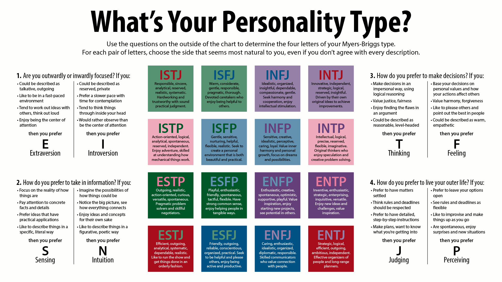

# Myers–Briggs

## Table of Contents

-   [What is Myers-Briggs Type Indicator?](#what-is-myers-briggs-type-indicator?)
-   [My 16Personalities Test](#my-16personalities-test)
    -   [2019-01-29](#2019-01-29)
    -   [2018-09-22](#2018-09-22)

## What is Myers-Briggs Type Indicator?

The Myers–Briggs Type Indicator (MBTI) is an introspective self-report questionnaire with the purpose of indicating differing psychological preferences in how people perceive the world around them and make decisions.

Reference: [Myers–Briggs Type Indicator](https://en.wikipedia.org/wiki/Myers%E2%80%93Briggs_Type_Indicator)

## My 16Personalities Test

The test is taken on [16Personalities](https://www.16personalities.com/).

### 2019-01-29

### 2018-09-22

